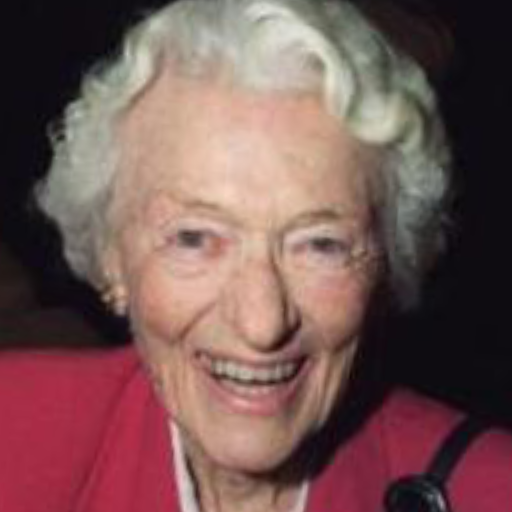
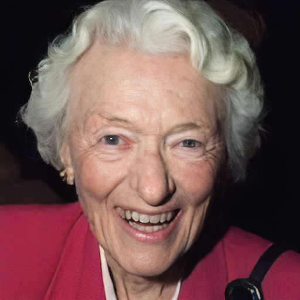
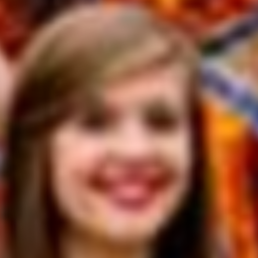
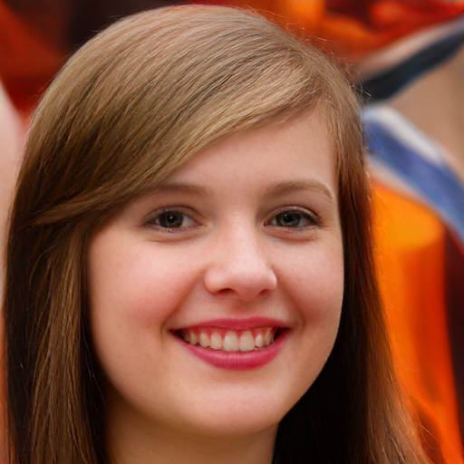
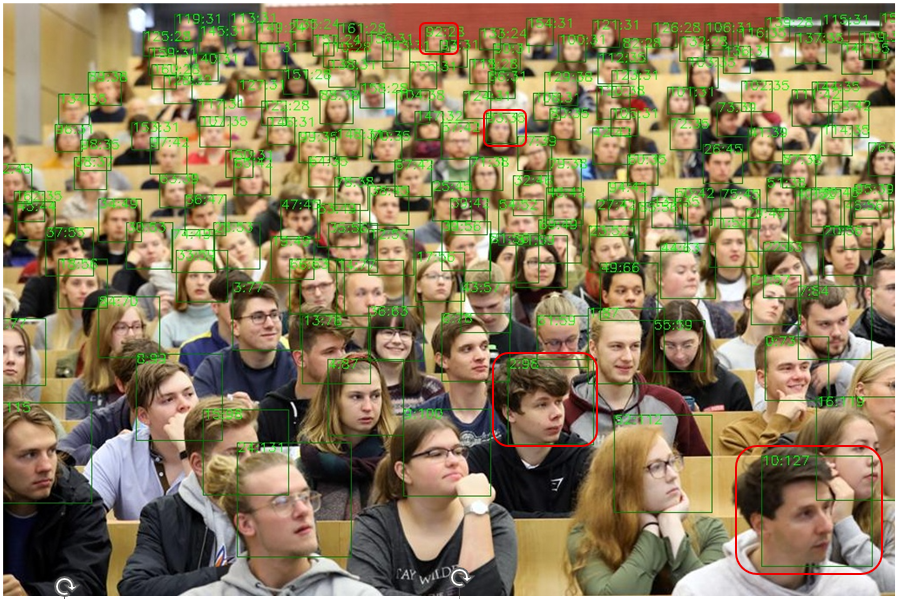

# Quality-Assisted Domain Transfer for Fast Face Super-Resolution
>Yi-Hao Cheng, Wan-Chi Siu (Life-FIEEE), and Shing-Chow Chan (SrMIEEE)
## About
**This Github document is to demonstrate more visual results of proposed method.**

---
### A. Synthetic CelebA dataset.

Fig. 1. Visual comparison with state-of-the-art methods on the Synthetic CelebA Dataset. For methods involving iterative sampling, we use the notation “Method-x”, where x denotes the number of sampling steps.

Fig. 2. Visual examples of our method.
### B. Commonly used real-world datasets.

Fig. 2. Visual comparison with state-of-the-art methods. For methods involving iterative sampling, we use the notation “Method-x”, where x denotes the number of sampling steps.
<!DOCTYPE html>
<html lang="en">
<head>
  
  <link rel="stylesheet" href="https://unpkg.com/img-comparison-slider@8/dist/styles.css">
  
</head>
<body>
  

    
      
      
      

        Upsampled LR
      

      

        SR Image
      

    </img-comparison-slider>
    
Fig. 3. Comparison between Upsampled LR and SR Image on real-world LR dataset LFW.

     
  

  

    
      
      
      

        Upsampled LR
      

      

        SR Image
      

    </img-comparison-slider>
    
Fig. 4. Comparison between Upsampled LR and SR Image on real-world LR dataset Wider-Test.

     
  

  

    
      
      
      

        Upsampled LR
      

      

        SR Image
      

    </img-comparison-slider>
    
Fig. 5. Comparison between Upsampled LR and SR Image on real-world LR dataset WebPhoto-Test.

  

</body>
</html>

## C. Natural LR faces extracted from a Classroom Photo.

Fig. 6. Students in classroom. Original image resolution: 1440*960. Image from [1]. X: Y means X is the face index, Y is the resolution.

Fig. 7. Visual comparison with state-of-the-art methods on natural LR faces extracted from a classroom photo.

### Reference
[1] D. Newton, "Online college classes should have no more than 12 students," Forbes, Jun. 28, 2020. [Online]. Available: https://www.forbes.com/sites/dereknewton/2020/06/28/online-college-classes-should-have-no-more-than-12-students/. [Accessed: Nov. 24, 2025].

